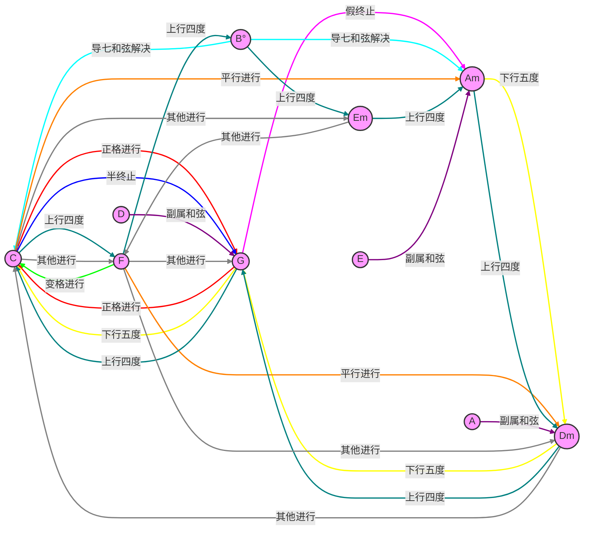

```mermaid
graph LR
    C((C)) -->|正格进行| G((G))
    G -->|正格进行| C
    F -->|变格进行| C
    C -->|半终止| G
    G -->|假终止| Am((Am))
    Am -->|下行五度| Dm((Dm))
    Dm -->|下行五度| G
    G -->|下行五度| C
    B((B°)) -->|导七和弦解决| C
    B -->|导七和弦解决| Am
    C -->|平行进行| Am
    F -->|平行进行| Dm
    C -->|上行四度| F((F))
    F -->|上行四度| B
    B -->|上行四度| Em((Em))
    Em -->|上行四度| Am
    Am -->|上行四度| Dm
    Dm -->|上行四度| G
    G -->|上行四度| C
    D((D)) -->|副属和弦| G
    A((A)) -->|副属和弦| Dm
    E((E)) -->|副属和弦| Am
    C -->|其他进行| F
    F -->|其他进行| G
    C -->|其他进行| Em
    Em -->|其他进行| F
    F -->|其他进行| Dm
    Dm -->|其他进行| C
    
    classDef default fill:#f9f,stroke:#333,stroke-width:2px;
    linkStyle 0,1 stroke:#ff0000,stroke-width:2px;
    linkStyle 2 stroke:#00ff00,stroke-width:2px;
    linkStyle 3 stroke:#0000ff,stroke-width:2px;
    linkStyle 4 stroke:#ff00ff,stroke-width:2px;
    linkStyle 5,6,7 stroke:#ffff00,stroke-width:2px;
    linkStyle 8,9 stroke:#00ffff,stroke-width:2px;
    linkStyle 10,11 stroke:#ff8000,stroke-width:2px;
    linkStyle 12,13,14,15,16,17,18 stroke:#008080,stroke-width:2px;
    linkStyle 19,20,21 stroke:#800080,stroke-width:2px;
    linkStyle 22,23,24,25,26,27 stroke:#808080,stroke-width:2px;
```